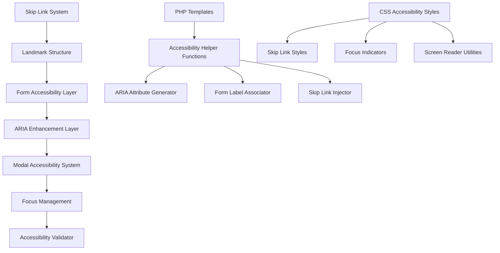

# Design Document: Accessibility Compliance Fix

## Overview

This design addresses critical accessibility compliance violations in the PHP marketplace application to achieve full WCAG 2.1 AA compliance. The solution implements systematic fixes for ARIA labels, form label associations, landmark structure, skip links, modal accessibility, heading hierarchy, and color contrast compliance.

The design follows a layered approach: infrastructure improvements (skip links, landmarks), component-level fixes (buttons, forms, modals), and validation enhancements. All changes maintain backward compatibility while significantly improving accessibility for users with disabilities.

## Architecture

### Component Architecture



### System Integration

The accessibility fixes integrate with the existing PHP application through:

1. **Template Enhancement**: Modify existing PHP templates to include proper ARIA attributes and landmarks
2. **Helper Function Layer**: Create reusable PHP functions for generating accessible markup
3. **CSS Enhancement**: Add accessibility-specific styles for skip links and focus management
4. **Validation Integration**: Enhance existing accessibility test to catch new violation types

## Components and Interfaces

### Skip Link System

**Purpose**: Provides keyboard users with shortcuts to bypass repetitive navigation

**Interface**:
```php
class SkipLinkSystem {
    public function generateSkipLinks(): string
    public function injectSkipLinks(string $content): string
    public function validateSkipLinkTargets(array $targets): bool
}
```

**Implementation Strategy**:
- Inject skip links as first focusable elements in page
- Use CSS to hide visually but keep accessible to screen readers
- Show on keyboard focus with smooth transitions
- Target main content areas with proper anchor links

### ARIA Enhancement Layer

**Purpose**: Adds proper ARIA labels and attributes to interactive elements

**Interface**:
```php
class ARIAEnhancer {
    public function enhanceButton(string $content, string $label): string
    public function addModalARIA(string $modalHtml): string
    public function validateARIAAttributes(string $html): array
}
```

**Implementation Strategy**:
- Scan existing templates for buttons without proper labels
- Add aria-label attributes to symbol-only buttons (×, icons)
- Enhance modal dialogs with role="dialog", aria-modal, aria-hidden
- Maintain existing functionality while adding accessibility

### Form Label Association System

**Purpose**: Ensures all form inputs have proper programmatic label associations

**Interface**:
```php
class FormAccessibilitySystem {
    public function associateLabelsWithInputs(string $formHtml): string
    public function generateUniqueIds(array $inputs): array
    public function validateLabelAssociations(string $html): array
}
```

**Implementation Strategy**:
- Generate unique IDs for inputs missing them
- Add 'for' attributes to labels referencing input IDs
- Maintain existing form styling and behavior
- Support both explicit labels and aria-labelledby patterns

### Landmark Structure System

**Purpose**: Provides proper page structure for screen reader navigation

**Interface**:
```php
class LandmarkSystem {
    public function addMainLandmark(string $content): string
    public function enhanceNavigation(string $navHtml): string
    public function validateLandmarks(string $html): array
}
```

**Implementation Strategy**:
- Wrap main content areas with `<main>` elements or role="main"
- Add proper roles to navigation, header, and footer elements
- Ensure single main landmark per page
- Maintain existing layout and styling

### Focus Management System

**Purpose**: Controls keyboard navigation flow, especially for modals and dynamic content

**Interface**:
```php
class FocusManager {
    public function generateFocusScript(): string
    public function addModalFocusHandling(string $modalJs): string
    public function validateFocusFlow(array $elements): bool
}
```

**Implementation Strategy**:
- Trap focus within open modals
- Return focus to triggering element when modal closes
- Ensure logical tab order throughout application
- Add visible focus indicators for keyboard users

## Data Models

### Accessibility Violation Model

```php
class AccessibilityViolation {
    public string $type;           // 'missing-aria-label', 'input-without-label', etc.
    public string $element;        // HTML element type
    public string $context;        // Surrounding context for identification
    public string $file;           // File path where violation occurs
    public string $remediation;    // Suggested fix
    public string $wcagReference;  // WCAG guideline reference
}
```

### Skip Link Configuration Model

```php
class SkipLinkConfig {
    public array $links = [
        ['text' => 'Skip to main content', 'target' => '#main-content'],
        ['text' => 'Skip to navigation', 'target' => '#main-nav'],
        ['text' => 'Skip to footer', 'target' => '#footer']
    ];
    public string $containerClass = 'skip-links';
    public bool $showOnFocus = true;
}
```

### Form Accessibility Configuration

```php
class FormAccessibilityConfig {
    public bool $autoGenerateIds = true;
    public string $idPrefix = 'form-field-';
    public bool $addRequiredIndicators = true;
    public bool $enhanceErrorMessages = true;
}
```

## Correctness Properties

*A property is a characteristic or behavior that should hold true across all valid executions of a system-essentially, a formal statement about what the system should do. Properties serve as the bridge between human-readable specifications and machine-verifiable correctness guarantees.*

Now I need to use the prework tool to analyze the acceptance criteria before writing the correctness properties:
